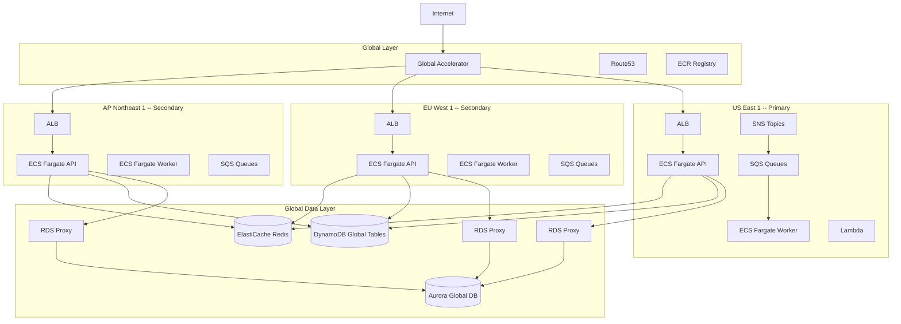
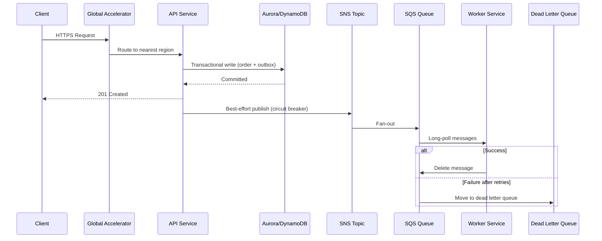

<div align="center">

<br>

<strong>Production-grade, globally distributed AWS infrastructure as code. Deploy to 6 regions with one terraform apply.</strong>

<br>
<br>

[](https://github.com/gufranco/aws-global-blueprint/actions/workflows/ci.yml)
[](#prerequisites)
[](#prerequisites)
[](#tech-stack)
[](#prerequisites)
[](LICENSE)

</div>

---

**9** Terraform modules, **10,300+** lines of IaC, **81** AWS resources across **30+** services, **6** regions, **78** tests, **12** CloudWatch alarms, **47** Makefile targets, **zero** known vulnerabilities

> The included Node.js application (API + Worker) is a **reference implementation** that demonstrates how the infrastructure works end-to-end. The real value is the Terraform modules. Bring your own application, keep the infra.

<table>
<tr>
<td width="50%" valign="top">

### Global Traffic Routing
Global Accelerator + Route53 anycast to the nearest healthy region with automatic failover in seconds.

</td>
<td width="50%" valign="top">

### Auto-Scaling Containers
ECS Fargate with CPU, memory, and SQS queue-depth scaling. Spot instances for workers at up to 70% savings.

</td>
</tr>
<tr>
<td width="50%" valign="top">

### Multi-Region Database
Aurora Global DB on Serverless v2 (0.5-128 ACU) with per-region RDS Proxy. Reads never leave the region.

</td>
<td width="50%" valign="top">

### Event-Driven Workers
SNS fan-out to SQS with dead letter queues, outbox pattern, circuit breakers, and retry classification.

</td>
</tr>
<tr>
<td width="50%" valign="top">

### Security Baseline
WAF + KMS + GuardDuty + Security Hub. Zero wildcard IAM. Encryption everywhere. VPC endpoints for private connectivity.

</td>
<td width="50%" valign="top">

### Full Observability
CloudWatch dashboards, 12 alarms, X-Ray distributed tracing, OpenTelemetry instrumentation, custom business metrics.

</td>
</tr>
<tr>
<td width="50%" valign="top">

### LocalStack Dev Environment
Full 6-region AWS environment running locally with Docker. No AWS account needed for development.

</td>
<td width="50%" valign="top">

### Chaos Engineering
AWS Fault Injection Simulator experiments, automated backups with cross-region copy, documented disaster recovery runbooks.

</td>
</tr>
</table>

## The Problem

Building multi-region infrastructure on AWS means weeks of stitching together VPCs, configuring cross-region data replication, layering security policies, wiring up observability, and hoping it all holds together during a regional failure. Most teams either skip global distribution entirely or build something fragile that breaks under real conditions.

## The Solution

A complete, opinionated infrastructure blueprint that deploys everything you need for a globally distributed application. Every module follows AWS Well-Architected best practices and works together out of the box.

| Capability | This Blueprint | From Scratch | AWS Landing Zone | CDK Patterns |
|:-----------|:--------------:|:------------:|:----------------:|:------------:|
| Multi-region compute | ✅ | Build it | VPC only | Partial |
| Aurora Global + per-region RDS Proxy | ✅ | Build it | ❌ | ❌ |
| Event-driven architecture (SNS/SQS/Lambda) | ✅ | Build it | ❌ | ✅ |
| WAF + GuardDuty + Security Hub | ✅ | Build it | ✅ | ❌ |
| CloudWatch dashboards + alarms | ✅ | Build it | Basic | ❌ |
| X-Ray + OpenTelemetry | ✅ | Build it | ❌ | Partial |
| Chaos engineering (FIS) | ✅ | Build it | ❌ | ❌ |
| Cost management + budgets | ✅ | Build it | Basic | ❌ |
| LocalStack 6-region dev environment | ✅ | Build it | ❌ | ❌ |
| Reference application included | ✅ | N/A | ❌ | ✅ |

## Architecture



### Event Flow



## What's Included

### Infrastructure (9 Terraform Modules)

| Module | Resources | Purpose |
|:-------|:----------|:--------|
| `global` | Global Accelerator, Route53, ECR | Anycast routing, DNS, container registry |
| `region` | VPC, ECS, ALB, SQS, SNS, Lambda, CodeDeploy | Per-region compute, networking, messaging |
| `data` | Aurora Global, DynamoDB Global Tables, ElastiCache, RDS Proxy | Multi-region data layer with local read replicas |
| `data-replica` | Aurora replica clusters, RDS Proxy | Per-region read replicas with local connection pooling |
| `security` | WAF, KMS, GuardDuty, Security Hub, VPC Endpoints | OWASP protection, encryption, threat detection |
| `observability` | CloudWatch Dashboards, 12 Alarms, X-Ray | Monitoring, alerting, distributed tracing |
| `compliance` | CloudTrail, AWS Config, Data Retention | Audit logging, continuous compliance |
| `resilience` | AWS Backup, Fault Injection Simulator | Automated backups, chaos engineering |
| `finops` | AWS Budgets, Cost Allocation | Per-service budget alerts, cost tracking |

### Reference Application

| Component | Stack | Purpose |
|:----------|:------|:--------|
| Shared library | TypeScript, Zod, AWS SDK v3, Pino, Opossum | Config validation, AWS clients, circuit breakers, metrics |
| API service | Fastify 5, Helmet, Rate Limiting, OpenAPI | REST API with Swagger docs, auth, region-aware routing |
| Worker service | SQS consumer, outbox sweeper, DLQ handler | Async message processing with deduplication and retry |

### Alarms

| Alarm | Condition | Severity |
|:------|:----------|:---------|
| API CPU High | CPU > 80% for 5 min | Warning |
| API Memory High | Memory > 80% for 5 min | Warning |
| ALB 5XX Errors | Error rate > 5% | Critical |
| P99 Latency High | Latency > 1000ms | Warning |
| DLQ Messages | Messages >= 1 | Critical |
| Queue Depth High | Messages > 1000 | Warning |
| Aurora ACU Utilization | Capacity > threshold for 5 min | Warning |
| Aurora Capacity Near Max | ACU within 10% of max for 5 min | Critical |
| RDS Proxy Pinned Connections | Pinned > 10 | Warning |
| RDS Proxy Pool Saturation | Borrow latency > 80 | Warning |
| Aurora Replication Lag | Lag > 5000ms | Critical |
| Aurora Connection Count | Connections > threshold for 5 min | Warning |

## Quick Start

### Prerequisites

| Tool | Version | Install |
|:-----|:--------|:--------|
| Terraform or OpenTofu | >= 1.5 / >= 1.6 | [terraform.io](https://www.terraform.io) / [opentofu.org](https://opentofu.org) |
| Node.js | 24 | [nodejs.org](https://nodejs.org) |
| pnpm | >= 8 | [pnpm.io](https://pnpm.io) |
| Docker | Latest | [docker.com](https://www.docker.com) |
| AWS CLI | v2 | [aws.amazon.com/cli](https://aws.amazon.com/cli/) |

### Local Development

```bash
git clone https://github.com/gufranco/aws-global-blueprint.git
cd aws-global-blueprint
make setup && make localstack-up
```

```bash
cd app
pnpm install && pnpm build
cp .env.example .env
cd api && node dist/index.js
```

### Verify

```bash
curl http://localhost:3000/health | jq .
# {"status":"healthy","region":"us-east-1","isPrimary":true,"tier":"primary",...}
```

```bash
curl -X POST http://localhost:3000/v1/orders \
  -H "Content-Type: application/json" \
  -d '{
    "customerId": "550e8400-e29b-41d4-a716-446655440000",
    "items": [{
      "productId": "550e8400-e29b-41d4-a716-446655440001",
      "productName": "Test Product",
      "quantity": 2,
      "unitPrice": 29.99,
      "totalPrice": 59.98
    }],
    "shippingAddress": {
      "street": "123 Main St",
      "city": "New York",
      "state": "NY",
      "country": "US",
      "postalCode": "10001"
    }
  }' | jq .
```

### Production Deployment

```bash
cd environments/prod
terraform init
cp terraform.tfvars.example terraform.tfvars  # Edit with your values
terraform plan -out=tfplan
terraform apply tfplan
```

## Supported Regions

| Region | Location | Tier | LocalStack Port |
|:-------|:---------|:-----|:----------------|
| us-east-1 | N. Virginia | Primary | 4566 |
| eu-west-1 | Ireland | Secondary | 4567 |
| ap-northeast-1 | Tokyo | Secondary | 4568 |
| sa-east-1 | Sao Paulo | Tertiary | 4569 |
| me-south-1 | Bahrain | Tertiary | 4570 |
| af-south-1 | Cape Town | Tertiary | 4571 |

Set `enabled = false` on any region in `terraform.tfvars` to skip it. The dev environment uses a single region by default.

## API Reference

All order endpoints are prefixed with `/v1/orders`. Health endpoints require no authentication.

| Method | Endpoint | Description |
|:-------|:---------|:------------|
| `GET` | `/health` | Basic health check (for ALB/Global Accelerator) |
| `GET` | `/health/detailed` | Dependency status: database, Redis, SQS |
| `GET` | `/health/live` | Liveness probe |
| `GET` | `/health/ready` | Readiness probe (checks database) |
| `POST` | `/v1/orders` | Create order with idempotency key support |
| `GET` | `/v1/orders/:id` | Get order by ID (cache-aside with Redis) |
| `GET` | `/v1/orders` | List orders with cursor-based pagination |
| `PATCH` | `/v1/orders/:id/status` | Update status with state machine validation |
| `DELETE` | `/v1/orders/:id` | Cancel order |

### Order Status Flow

```
pending --> confirmed --> processing --> shipped --> delivered
  |             |             |
  v             v             v
cancelled   cancelled     cancelled
```

### Error Response Format

```json
{
  "error": {
    "code": "VALIDATION_ERROR",
    "message": "Invalid status transition from 'shipped' to 'pending'",
    "requestId": "req-abc-123",
    "details": { "currentStatus": "shipped", "allowedTransitions": ["delivered"] }
  }
}
```

<details>
<summary><strong>Project structure</strong></summary>

```
aws-global-blueprint/
  modules/
    global/             # Global Accelerator, Route53, ECR
    region/             # VPC, ECS, ALB, SQS, SNS, Lambda, CodeDeploy
    data/               # Aurora Global, DynamoDB Global, ElastiCache, RDS Proxy
    data-replica/       # Aurora replica clusters with local RDS Proxy
    security/           # WAF, KMS, GuardDuty, Security Hub, VPC Endpoints
    observability/      # CloudWatch Dashboards, Alarms, X-Ray
    compliance/         # CloudTrail, AWS Config, Data Retention
    resilience/         # AWS Backup, Fault Injection Simulator
    finops/             # AWS Budgets, Cost Management
  environments/
    dev/                # Single-region development
    prod/               # Multi-region production
  app/
    shared/             # TypeScript library: AWS clients, config, types, metrics
    api/                # Fastify REST API with OpenAPI docs
    worker/             # SQS consumer with outbox sweeper and DLQ handler
  localstack/
    docker-compose.yml  # 6-region LocalStack + PostgreSQL + Redis
    init-scripts/       # Per-region DynamoDB, SQS, SNS, S3 setup
  tests/
    integration/        # Integration tests with LocalStack
    load/               # K6 performance tests
  docs/
    adr/                # Architecture Decision Records
    runbooks/           # Disaster recovery procedures
    postman/            # API collection
  scripts/              # Setup, validation, and test helpers
  Makefile              # 47 targets (run: make help)
```

</details>

## Development Commands

Run `make help` to see all 47 targets. All IaC commands support `TOOL=tofu` for OpenTofu.

### Infrastructure

| Command | Description |
|:--------|:------------|
| `make init` | Initialize IaC for current environment |
| `make plan` | Plan IaC changes |
| `make apply` | Apply IaC changes |
| `make fmt` | Format all Terraform files |
| `make validate-modules` | Validate all 9 IaC modules |

### LocalStack

| Command | Description |
|:--------|:------------|
| `make localstack-up` | Start 6-region LocalStack with health checks |
| `make localstack-down` | Stop all LocalStack containers |
| `make localstack-status` | Show status of all regions |
| `make localstack-logs REGION=us-east-1` | Show logs for a specific region |

### Application

| Command | Description |
|:--------|:------------|
| `make up` | Start everything: LocalStack + App |
| `make app-build` | Build Docker images for API and Worker |
| `make app-test` | Run test suite |
| `make test-load` | Run K6 load tests |

### Database

| Command | Description |
|:--------|:------------|
| `make db-connect` | Connect to PostgreSQL |
| `make db-migrate` | Run database migrations |
| `make redis-cli` | Connect to Redis CLI |

## Environment Variables

The full list of 49 variables is documented in `app/.env.example`. Key groups:

| Variable | Description | Default |
|:---------|:------------|:--------|
| `NODE_ENV` | Environment | `development` |
| `PORT` | API server port | `3000` |
| `AWS_REGION` | AWS region | `us-east-1` |
| `IS_PRIMARY_REGION` | Primary region flag | `true` |
| `REGION_TIER` | Region tier | `primary` |
| `DATABASE_HOST` | RDS Proxy endpoint | `localhost` |
| `REDIS_HOST` | Redis host | `localhost` |
| `DYNAMODB_ORDERS_TABLE` | DynamoDB table name | `blueprint-dev-orders` |
| `SQS_ORDER_QUEUE_URL` | Order processing queue | -- |
| `SNS_ORDER_TOPIC_ARN` | Order events topic | -- |
| `API_KEY` | API authentication key (required in production) | -- |
| `USE_LOCALSTACK` | Enable LocalStack mode | `false` |

## Region Configuration

```hcl
# environments/prod/terraform.tfvars

regions = {
  us_east_1 = {
    enabled     = true
    aws_region  = "us-east-1"
    is_primary  = true
    tier        = "primary"
    cidr_block  = "10.0.0.0/16"
    ecs_api_min = 2
    ecs_api_max = 20
    enable_nat  = true
  }
  eu_west_1 = {
    enabled     = true
    aws_region  = "eu-west-1"
    is_primary  = false
    tier        = "secondary"
    cidr_block  = "10.1.0.0/16"
    ecs_api_min = 2
    ecs_api_max = 10
    enable_nat  = true
  }
}
```

Each secondary region gets an Aurora replica cluster with a local RDS Proxy, deployed via the `data-replica` module. Read queries never leave the region.

## Security

### WAF Protection

OWASP Top 10 coverage: Core Rule Set, Known Bad Inputs, SQL Injection protection. Rate limited to 2000 requests per 5 minutes per IP. Configurable geo blocking and IP allowlisting.

### Encryption

| Layer | Method |
|:------|:-------|
| RDS/Aurora | KMS at rest |
| DynamoDB | AWS managed encryption |
| S3 | SSE-KMS with bucket keys |
| SQS | Server-side encryption |
| ElastiCache | In-transit and at-rest |
| Secrets | KMS-encrypted Secrets Manager |

### IAM

All policies scoped to specific resource ARNs. KMS key policies use `kms:CallerAccount` conditions. No wildcard permissions in production roles.

## Architecture Decisions

| ADR | Decision | Rationale |
|:----|:---------|:----------|
| [001](docs/adr/001-ecs-fargate.md) | ECS Fargate over EC2/EKS | Operational simplicity, no cluster management, per-region independence |
| [002](docs/adr/002-multi-region-data.md) | Aurora Global + DynamoDB Global Tables + Redis | Hybrid approach: relational for consistency, NoSQL for scale, cache for speed |
| [003](docs/adr/003-event-driven-architecture.md) | SNS/SQS with outbox pattern | At-least-once delivery with circuit breakers and dead letter queues |

## Disaster Recovery

Documented runbook at [docs/runbooks/disaster-recovery.md](docs/runbooks/disaster-recovery.md) covering:

- Primary region failure with Global Accelerator failover
- Aurora database corruption and point-in-time recovery
- DLQ overflow investigation and replay
- Security incident response procedures

<details>
<summary><strong>FAQ</strong></summary>
<br>

<details>
<summary><strong>Can I use fewer regions?</strong></summary>
<br>

Set `enabled = false` on any region in `terraform.tfvars`. The dev environment uses a single region by default. You can run production with just 2 regions.

</details>

<details>
<summary><strong>How much does this cost?</strong></summary>
<br>

A minimal 2-region setup with Aurora Serverless v2 at 0.5 ACU, Fargate Spot workers, and low traffic runs under $500/month. A full 6-region deployment ranges from $2,000-$10,000+/month depending on traffic and capacity. The FinOps module includes budget alerts.

</details>

<details>
<summary><strong>Can I use Kubernetes instead of ECS?</strong></summary>
<br>

The compute layer is modular. Replace the `region` module's ECS resources with EKS. The rest of the stack (data layer, security, observability, networking) stays the same. See [ADR-001](docs/adr/001-ecs-fargate.md) for why ECS was chosen.

</details>

<details>
<summary><strong>What happens during a regional failure?</strong></summary>
<br>

Global Accelerator detects the failure via health checks and reroutes traffic within seconds. Aurora promotes a replica to primary if the primary region fails. DynamoDB Global Tables continue serving from any remaining region. See the [disaster recovery runbook](docs/runbooks/disaster-recovery.md).

</details>

<details>
<summary><strong>Does this work with existing VPCs?</strong></summary>
<br>

The blueprint creates its own VPCs with non-overlapping CIDR blocks. To integrate with existing VPCs, modify the `region` module to accept VPC IDs instead of creating new ones.

</details>

</details>

## Tech Stack

| Category | Technology |
|:---------|:-----------|
| IaC | Terraform >= 1.5 / OpenTofu >= 1.6 |
| Runtime | Node.js 24 |
| Language | TypeScript 5.9 (strict mode, noUncheckedIndexedAccess) |
| Framework | Fastify 5 with Helmet, CORS, Rate Limiting |
| Validation | Zod 4 with input and output schemas |
| Database | Aurora Serverless v2 (PostgreSQL), DynamoDB Global Tables |
| Cache | ElastiCache Redis with Global Datastore |
| Messaging | SNS + SQS with dead letter queues |
| Observability | CloudWatch, X-Ray, OpenTelemetry, Pino 10 |
| Resilience | Opossum circuit breakers, outbox pattern, FIS |
| Testing | Vitest 4, Faker.js, 78 tests |
| Linting | ESLint 10 flat config, Prettier, commitlint |
| CI/CD | GitHub Actions (8 jobs: IaC fmt, validate, security, build, lint, test, Docker, audit) |
| Containers | Docker multi-stage builds, tini, non-root user |

## License

[MIT](LICENSE)
