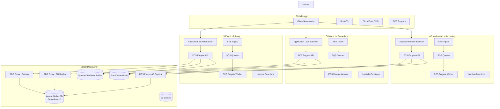
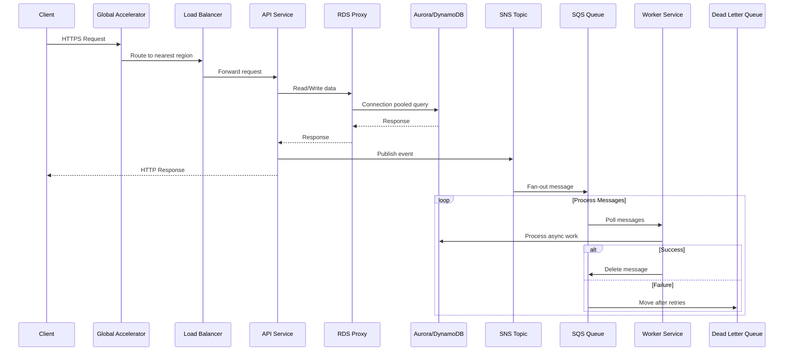

# AWS Global Blueprint

[](#prerequisites)
[](#prerequisites)
[](#supported-aws-regions)
[](#)
[](#)
[](#)
[](LICENSE)

> Production-grade, globally distributed AWS infrastructure as code. Deploy to 6 regions with one `terraform apply`.

**9 Terraform modules. 30+ AWS services. 6 regions. Zero manual setup.**

> **Note**: The included Node.js application (API + Worker) is a **reference implementation** to demonstrate how the infrastructure works end-to-end. The real value of this project is the Terraform modules. Bring your own application, keep the infra.

---

## The Problem

Building multi-region infrastructure on AWS means weeks of stitching together VPCs, configuring cross-region data replication, layering security policies, wiring up observability, and hoping it all holds together during a regional failure. Most teams either skip global distribution entirely or build something fragile that breaks under real conditions.

## The Solution

A complete, opinionated infrastructure blueprint that deploys everything you need for a globally distributed application. Every module follows AWS Well-Architected best practices and is designed to work together out of the box.

| What you get | How it works |
|---|---|
| **Global traffic routing** | Global Accelerator + Route53 anycast to the nearest healthy region |
| **Auto-scaling containers** | ECS Fargate with CPU/memory/queue-depth scaling, Spot workers |
| **Multi-region database** | Aurora Global DB on Serverless v2 with per-region RDS Proxy |
| **Event-driven workers** | SNS fan-out to SQS with Dead Letter Queues and retry policies |
| **Full observability** | CloudWatch dashboards, 11 alarms, X-Ray tracing, OpenTelemetry |
| **Security baseline** | WAF + KMS + GuardDuty + Security Hub, zero wildcard IAM |
| **Cost controls** | Fargate Spot, Serverless v2 auto-scaling, per-service budgets |
| **Disaster recovery** | Cross-region backups, documented runbooks, fault injection testing |

```bash
git clone https://github.com/gufranco/aws-global-blueprint.git
cd aws-global-blueprint
make setup && make localstack-up  # Full 6-region dev environment
```

---

## Architecture Pillars

Six design principles guide every decision in this blueprint.

### 1. Region Independence

Each region is a self-contained unit: its own VPC, compute, queues, and database replica. If a region goes down, the others keep serving traffic with zero manual intervention. Global Accelerator detects failures and reroutes within seconds.

### 2. Data Locality

Every region has a local RDS Proxy connected to a local Aurora replica. Read queries never leave the region. Secrets Manager replicates credentials to each region so authentication stays local too. The only cross-region data flow is Aurora's storage-level replication, which runs at sub-second lag.

### 3. Fail-Static

When something breaks, the system degrades gracefully instead of cascading. Circuit breakers prevent slow dependencies from dragging down the API. Dead Letter Queues capture failed messages for replay. Health checks remove unhealthy instances before users notice.

### 4. Cost-Aware Scaling

Aurora Serverless v2 scales from 0.5 ACU to 128 ACU based on actual load, so you only pay for what you use. Worker services run on Fargate Spot for up to 70% savings. Tertiary regions start with minimal capacity and scale up on demand. S3 lifecycle policies automatically archive old data to Glacier.

### 5. Security by Default

Every data store is encrypted at rest with KMS. Every connection uses TLS. IAM policies are scoped to specific resource ARNs, never wildcards. WAF protects against OWASP Top 10. GuardDuty monitors for threats. This is the baseline, not an add-on.

### 6. Observable from Day One

Every region gets a CloudWatch dashboard, 11 preconfigured alarms, X-Ray distributed tracing, and OpenTelemetry instrumentation. You can see what's happening in production before you deploy your first feature.

---

## How It Compares

| Capability | This Blueprint | From Scratch | AWS Landing Zone | CDK Patterns |
|---|:---:|:---:|:---:|:---:|
| Multi-region compute | Yes | Build it | VPC only | Partial |
| Aurora Global + RDS Proxy | Yes | Build it | No | No |
| Per-region read replicas with local proxy | Yes | Build it | No | No |
| Event-driven architecture (SNS/SQS/Lambda) | Yes | Build it | No | Yes |
| WAF + GuardDuty + Security Hub | Yes | Build it | Yes | No |
| CloudWatch dashboards + alarms | Yes | Build it | Basic | No |
| X-Ray + OpenTelemetry | Yes | Build it | No | Partial |
| Chaos engineering (FIS) | Yes | Build it | No | No |
| Cost management + budgets | Yes | Build it | Basic | No |
| LocalStack 6-region dev environment | Yes | Build it | No | No |
| Reference application included | Yes | N/A | No | Yes |
| Time to deploy | ~30 min | Weeks/months | Hours | Hours |

---

## Architecture Overview



### Event-Driven Data Flow



---

## What's Included

### Infrastructure (the core)

Everything below is what you get. This is the project's focus: production-ready IaC modules you can deploy as-is or customize for your stack.
- **Multi-Region Deployment**: Deploy across 6+ AWS regions globally
- **Global Accelerator**: Anycast routing for optimal latency worldwide
- **ECS Fargate**: Serverless container orchestration, no EC2 management
- **Auto Scaling**: CPU, memory, and SQS queue-depth based scaling
- **Blue/Green Deployments**: Zero-downtime deployments with CodeDeploy

### Data Layer
- **Aurora Global Database**: Multi-region PostgreSQL with Serverless v2 auto-scaling (0.5-128 ACUs)
- **RDS Proxy**: Connection pooling with TLS enforcement, read/write split endpoints per region
- **Aurora Replica Clusters**: Per-region read replicas with local RDS Proxy, eliminating cross-region read latency
- **DynamoDB Global Tables**: Multi-master NoSQL with automatic replication
- **ElastiCache Redis**: Global Datastore for caching and sessions
- **S3**: Cross-region replication for assets and backups
- **Secrets Manager**: Multi-region secret replication for local credential access

### Event-Driven
- **SNS Topics**: Pub/sub messaging with filter policies
- **SQS Queues**: Standard, FIFO, and Dead Letter Queues
- **Lambda Functions**: Serverless event processors
- **EventBridge**: Event routing and scheduling

### Security
- **WAF**: OWASP Top 10 protection, rate limiting, geo blocking
- **KMS**: Encryption at rest for all data stores with account-scoped policies
- **GuardDuty**: Threat detection and monitoring
- **Security Hub**: Centralized security findings
- **VPC Endpoints**: Private connectivity to AWS services
- **Secrets Manager**: Automatic credential rotation
- **IAM Least Privilege**: Scoped resource ARNs, no wildcard permissions

### Observability
- **CloudWatch**: Dashboards, alarms, and log aggregation
- **X-Ray**: Distributed tracing across services
- **OpenTelemetry**: Instrumentation and metrics collection
- **Custom Metrics**: Business KPIs like orders/min and latency p99

### Resilience
- **Circuit Breakers**: Graceful degradation on failures
- **AWS Backup**: Automated daily/weekly backups with cross-region copy
- **Fault Injection Simulator**: Chaos engineering experiments
- **Disaster Recovery Runbooks**: Documented recovery procedures

### Cost Optimization
- **Fargate Spot**: Up to 70% savings on worker services
- **Aurora Serverless v2**: Pay-per-use compute that scales to zero-ish (0.5 ACU minimum)
- **AWS Budgets**: Proactive cost alerts per service
- **Cost Allocation Tags**: Detailed cost tracking
- **S3 Lifecycle Policies**: Automatic data tiering to Glacier

---

## Project Structure

```
aws-global-blueprint/
├── modules/
│   ├── global/           # Global Accelerator, Route53, ECR
│   ├── region/           # VPC, ECS, ALB, SQS, SNS, Lambda, CodeDeploy
│   ├── data/             # Aurora Global, DynamoDB Global, ElastiCache, RDS Proxy
│   ├── data-replica/     # Aurora replica clusters with local RDS Proxy per secondary region
│   ├── security/         # WAF, KMS, GuardDuty, Security Hub, VPC Endpoints
│   ├── observability/    # CloudWatch Dashboards, Alarms, X-Ray
│   ├── compliance/       # CloudTrail, AWS Config, Data Retention
│   ├── resilience/       # AWS Backup, Fault Injection Simulator
│   └── finops/           # AWS Budgets, Cost Management
├── environments/
│   ├── dev/              # Development environment (single region)
│   └── prod/             # Production multi-region deployment
├── app/                    # Reference application (replace with your own)
│   ├── shared/           # Shared TypeScript library (@blueprint/shared)
│   │   └── src/
│   │       ├── aws/      # AWS SDK clients (DynamoDB, SQS, SNS, S3)
│   │       ├── config/   # Environment configuration with Zod validation
│   │       ├── resilience/  # Circuit breaker patterns
│   │       ├── tracing/  # OpenTelemetry setup
│   │       └── metrics/  # Custom CloudWatch metrics
│   ├── api/              # Fastify REST API service
│   │   ├── Dockerfile
│   │   └── src/
│   │       ├── routes/   # API endpoints (health, orders)
│   │       ├── services/ # Business logic
│   │       └── middleware/  # Region awareness, validation
│   ├── worker/           # SQS message processor service
│   │   ├── Dockerfile
│   │   └── src/
│   │       └── handlers/ # Message handlers (orders, notifications)
│   └── .env.example      # Required environment variables
├── localstack/
│   ├── docker-compose.yml  # Multi-region LocalStack setup (6 regions)
│   └── init-scripts/       # Per-region initialization scripts
├── scripts/
│   ├── validate-all.sh     # Validate all Terraform modules
│   ├── test-localstack.sh  # Test LocalStack infrastructure
│   └── setup-localstack.sh # LocalStack setup helper
├── tests/
│   ├── integration/      # Integration tests with LocalStack
│   ├── load/             # K6 performance tests
│   └── terraform/        # Terratest infrastructure tests
├── docs/
│   ├── adr/              # Architecture Decision Records
│   ├── runbooks/         # Operational runbooks
│   └── postman/          # API collection
├── Makefile              # Development commands (run: make help)
└── README.md
```

---

## Quick Start

### Prerequisites

| Tool | Version | Purpose |
|------|---------|---------|
| Terraform or OpenTofu | >= 1.5 / >= 1.6 | Infrastructure as Code |
| Node.js | 24 | Application runtime |
| pnpm | >= 8 | Package manager |
| Docker | Latest | LocalStack and containers |
| AWS CLI | v2 | AWS interactions |

### Local Development with LocalStack

The entire 6-region setup runs locally using LocalStack. No AWS account needed for development.

```bash
# 1. Clone and set up the project
git clone https://github.com/gufranco/aws-global-blueprint.git
cd aws-global-blueprint
make setup

# 2. Start LocalStack (6 AWS regions + PostgreSQL + Redis)
make localstack-up

# 3. Install and build the application
cd app
pnpm install
pnpm build

# 4. Configure environment variables
cp .env.example .env

# 5. Start the API
cd api
node dist/index.js
```

The API will be available at:
- **API**: http://localhost:3000
- **Health Check**: http://localhost:3000/health

### Test the API

```bash
# Health check
curl http://localhost:3000/health | jq .

# Create an order
curl -X POST http://localhost:3000/api/orders \
  -H "Content-Type: application/json" \
  -d '{
    "customerId": "550e8400-e29b-41d4-a716-446655440000",
    "items": [{
      "productId": "550e8400-e29b-41d4-a716-446655440001",
      "productName": "Test Product",
      "quantity": 2,
      "unitPrice": 29.99,
      "totalPrice": 59.98
    }],
    "shippingAddress": {
      "street": "123 Main St",
      "city": "New York",
      "state": "NY",
      "country": "US",
      "postalCode": "10001"
    }
  }' | jq .

# List orders
curl "http://localhost:3000/api/orders?customerId=550e8400-e29b-41d4-a716-446655440000" | jq .
```

### Production Deployment

```bash
# 1. Configure AWS credentials
export AWS_PROFILE=production

# 2. Initialize Terraform backend (S3 + DynamoDB for state locking)
cd environments/prod
terraform init

# 3. Review and customize variables
cp terraform.tfvars.example terraform.tfvars
# Edit terraform.tfvars with your values

# 4. Plan and apply
terraform plan -out=tfplan
terraform apply tfplan
```

---

## Development Commands

Run `make help` to see all available targets. All IaC commands support `TOOL=tofu` for OpenTofu: `make plan TOOL=tofu`.

### Infrastructure

| Command | Description |
|---------|-------------|
| `make init` | Initialize IaC for current environment |
| `make plan` | Plan IaC changes |
| `make apply` | Apply IaC changes |
| `make destroy` | Destroy infrastructure for current environment |
| `make output` | Show IaC outputs |
| `make fmt` | Format all Terraform/OpenTofu files |
| `make fmt-check` | Check Terraform/OpenTofu formatting |
| `make init-modules` | Initialize all IaC modules |
| `make validate-modules` | Validate all IaC modules |

### LocalStack

| Command | Description |
|---------|-------------|
| `make localstack-up` | Start multi-region LocalStack with health checks |
| `make localstack-down` | Stop all LocalStack containers |
| `make localstack-clean` | Stop LocalStack and remove volumes |
| `make localstack-status` | Show status of all regions |
| `make localstack-logs REGION=us-east-1` | Show logs for a specific region |
| `make localstack-logs-all` | Show logs from all LocalStack containers |
| `make localstack-init` | Run init scripts for all regions |

### Application

| Command | Description |
|---------|-------------|
| `make up` | Start everything: LocalStack + App |
| `make down` | Stop everything |
| `make restart` | Restart everything |
| `make app-build` | Build Docker images for API and Worker |
| `make app-up` | Start application services only |
| `make app-down` | Stop application services |
| `make app-logs` | Show application logs |
| `make app-test` | Run application tests |

### Testing

| Command | Description |
|---------|-------------|
| `make test` | Run all tests |
| `make test-unit` | Run unit tests |
| `make test-integration` | Run integration tests (requires LocalStack) |
| `make test-e2e` | Run E2E tests |
| `make test-load` | Run load tests with k6 |

### CI/CD

| Command | Description |
|---------|-------------|
| `make ci-lint` | Run linters (Terraform + app) |
| `make ci-test` | Run tests for CI |
| `make ci-build` | Build for CI |
| `make ci-security` | Run security scans (tfsec + pnpm audit) |

### AWS CLI Shortcuts

These commands target LocalStack and accept `REGION=<region>`:

| Command | Description |
|---------|-------------|
| `make list-sqs` | List SQS queues |
| `make list-sns` | List SNS topics |
| `make list-dynamodb` | List DynamoDB tables |
| `make list-s3` | List S3 buckets |
| `make list-secrets` | List Secrets Manager secrets |
| `make list-logs` | List CloudWatch log groups |
| `make list-all-regions` | List SQS queues across all 6 regions |

### Database

| Command | Description |
|---------|-------------|
| `make db-connect` | Connect to PostgreSQL |
| `make db-migrate` | Run database migrations |
| `make db-seed` | Seed database with sample data |
| `make db-reset` | Drop and recreate the database |
| `make redis-cli` | Connect to Redis CLI |

### Utilities

| Command | Description |
|---------|-------------|
| `make setup` | Initial project setup |
| `make clean` | Clean temporary files (.terraform, state, zips) |
| `make clean-all` | Clean everything including Docker volumes |

---

## Region Configuration

### Supported AWS Regions

| Region | Location | Tier | LocalStack Port |
|--------|----------|------|-----------------|
| us-east-1 | N. Virginia | Primary | 4566 |
| eu-west-1 | Ireland | Secondary | 4567 |
| ap-northeast-1 | Tokyo | Secondary | 4568 |
| sa-east-1 | Sao Paulo | Tertiary | 4569 |
| me-south-1 | Bahrain | Tertiary | 4570 |
| af-south-1 | Cape Town | Tertiary | 4571 |

### Terraform Configuration

```hcl
# environments/prod/terraform.tfvars

project_name = "blueprint"
environment  = "prod"

# Aurora Serverless v2 capacity (ACUs)
aurora_serverless_min_capacity = 2    # Minimum ACUs (0.5-128)
aurora_serverless_max_capacity = 64   # Maximum ACUs (1-128)

regions = {
  us_east_1 = {
    enabled     = true
    aws_region  = "us-east-1"
    is_primary  = true
    tier        = "primary"
    cidr_block  = "10.0.0.0/16"
    ecs_api_min = 2
    ecs_api_max = 20
    enable_nat  = true
  }
  eu_west_1 = {
    enabled     = true
    aws_region  = "eu-west-1"
    is_primary  = false
    tier        = "secondary"
    cidr_block  = "10.1.0.0/16"
    ecs_api_min = 2
    ecs_api_max = 10
    enable_nat  = true
  }
  ap_northeast_1 = {
    enabled     = true
    aws_region  = "ap-northeast-1"
    is_primary  = false
    tier        = "secondary"
    cidr_block  = "10.2.0.0/16"
    ecs_api_min = 2
    ecs_api_max = 10
    enable_nat  = true
  }
}
```

Each secondary region gets an Aurora replica cluster with a local RDS Proxy, deployed via the `data-replica` module. This eliminates cross-region latency for read queries. The primary region's RDS Proxy provides both read-write and read-only endpoints.

---

## API Reference

### Endpoints

| Method | Endpoint | Description |
|--------|----------|-------------|
| `GET` | `/health` | Basic health check |
| `GET` | `/health/ready` | Readiness probe |
| `GET` | `/health/live` | Liveness probe |
| `GET` | `/health/detailed` | Health with dependency status |
| `POST` | `/api/orders` | Create a new order |
| `GET` | `/api/orders/:id` | Get order by ID |
| `GET` | `/api/orders` | List orders with pagination |
| `PATCH` | `/api/orders/:id/status` | Update order status |

### Query Parameters

| Endpoint | Parameter | Type | Description |
|----------|-----------|------|-------------|
| `GET /api/orders` | `customerId` | UUID | Filter by customer |
| `GET /api/orders` | `status` | string | Filter by status |
| `GET /api/orders` | `page` | number | Page number, default: 1 |
| `GET /api/orders` | `limit` | number | Items per page, default: 20, max: 100 |

### Order Status Flow

```
pending -> confirmed -> processing -> shipped -> delivered
  |            |            |
  v            v            v
cancelled  cancelled    cancelled
```

---

## Environment Variables

All variables are documented in `app/.env.example`. Copy it to `.env` and fill in the values.

### Application

| Variable | Description | Default |
|----------|-------------|---------|
| `NODE_ENV` | Environment: development, staging, production | `development` |
| `PORT` | API server port | `3000` |
| `PROJECT_NAME` | Project identifier used in resource names | `blueprint` |
| `CORS_ALLOWED_ORIGINS` | Comma-separated allowed origins for CORS | all origins in dev |

### AWS/Region

| Variable | Description | Default |
|----------|-------------|---------|
| `AWS_REGION` | AWS region code | `us-east-1` |
| `REGION_KEY` | Region identifier | `us_east_1` |
| `IS_PRIMARY_REGION` | Primary region flag | `true` |
| `REGION_TIER` | Region tier: primary, secondary, tertiary | `primary` |

### LocalStack

| Variable | Description | Default |
|----------|-------------|---------|
| `USE_LOCALSTACK` | Enable LocalStack mode | `false` |
| `LOCALSTACK_ENDPOINT` | LocalStack endpoint URL | `http://localhost:4566` |

### Data Stores

| Variable | Description | Default |
|----------|-------------|---------|
| `DATABASE_URL` | Full PostgreSQL connection string (overrides individual vars) | - |
| `DATABASE_HOST` | RDS Proxy endpoint (primary read-write) | - |
| `DATABASE_READ_HOST` | RDS Proxy read-only endpoint | - |
| `DATABASE_PORT` | PostgreSQL port | `5432` |
| `DATABASE_USER` | Database username | - |
| `DATABASE_PASSWORD` | Database password | - |
| `DATABASE_NAME` | Database name | - |
| `REDIS_HOST` | Redis host | `localhost` |
| `REDIS_PORT` | Redis port | `6379` |
| `REDIS_PASSWORD` | Redis password | - |
| `DYNAMODB_ORDERS_TABLE` | DynamoDB orders table name | `blueprint-dev-orders` |

### Messaging

| Variable | Description | Default |
|----------|-------------|---------|
| `SQS_ORDER_QUEUE_URL` | Order processing queue URL | - |
| `SQS_NOTIFICATION_QUEUE_URL` | Notification queue URL | - |
| `SQS_DLQ_URL` | Dead letter queue URL | - |
| `SNS_ORDER_TOPIC_ARN` | Order events topic ARN | - |
| `SNS_NOTIFICATION_TOPIC_ARN` | Notification topic ARN | - |

### Observability

| Variable | Description | Default |
|----------|-------------|---------|
| `OTEL_SERVICE_NAME` | OpenTelemetry service name | `blueprint-app` |
| `OTEL_EXPORTER_OTLP_ENDPOINT` | OTLP exporter endpoint | - |

---

## Monitoring

### CloudWatch Dashboards

Each region has a dedicated dashboard displaying:
- ECS CPU and Memory utilization
- ALB request count, latency at p50, p90, and p99
- HTTP status code distribution: 2XX, 4XX, 5XX
- SQS queue depth and message age
- DLQ message count and error rate

### Alarms

| Alarm | Condition | Severity |
|-------|-----------|----------|
| API CPU High | CPU > 80% for 5 min | Warning |
| API Memory High | Memory > 80% for 5 min | Warning |
| ALB 5XX Errors | Error rate > 5% | Critical |
| P99 Latency High | Latency > 1000ms | Warning |
| DLQ Messages | Messages >= 1 | Critical |
| Queue Depth High | Messages > 1000 | Warning |
| Aurora ACU Utilization | ServerlessDatabaseCapacity > threshold for 5 min | Warning |
| Aurora Capacity Near Max | ACU within 10% of max for 5 min | Critical |
| RDS Proxy Pinned Connections | DatabaseConnectionsCurrentlySessionPinned > 10 | Warning |
| RDS Proxy Pool Saturation | DatabaseConnectionsBorrowLatency > 80 | Warning |
| Aurora Replication Lag | AuroraGlobalDBReplicationLag > 5000ms | Critical |

### X-Ray Tracing

Distributed tracing is enabled by default. View traces in the AWS X-Ray console to analyze request flow across services and regions.

---

## Security

### WAF Protection

- **AWS Managed Rules**: Core Rule Set, Known Bad Inputs, SQL Injection
- **Rate Limiting**: 2000 requests per 5 minutes per IP
- **Geo Blocking**: Configurable country restrictions
- **IP Allowlisting**: Bypass rules for trusted IPs

### Encryption

| Data | Encryption |
|------|------------|
| RDS/Aurora | KMS encryption at rest |
| DynamoDB | AWS managed encryption |
| S3 | SSE-KMS with bucket keys |
| SQS | Server-side encryption |
| ElastiCache | In-transit and at-rest encryption |
| Secrets | KMS-encrypted Secrets Manager |

### Bastion Host

A minimal `t4g.nano` EC2 instance in a public subnet for SSH access to private resources like Aurora, ElastiCache, and RDS Proxy. Disabled by default.

**Setting up SSH access:**

```bash
# 1. Generate an SSH key (if you don't have one)
ssh-keygen -t ed25519 -C "your-email@example.com"

# 2. Import your public key as an EC2 key pair
aws ec2 import-key-pair \
  --key-name bastion \
  --public-key-material fileb://~/.ssh/id_ed25519.pub \
  --region us-east-1

# 3. Enable the bastion in terraform.tfvars
# enable_bastion       = true
# bastion_key_name     = "bastion"
# bastion_allowed_cidr = "YOUR_IP/32"   # Lock to your IP

# 4. Apply and connect
terraform apply
ssh ec2-user@$(terraform output -raw bastion_public_ip)

# 5. From the bastion, access private resources
psql -h <rds-proxy-endpoint> -U postgres -d app
redis-cli -h <redis-endpoint>
```

To add another team member's key, import their public key as a separate EC2 key pair or add it to the bastion's `~/.ssh/authorized_keys` via user data or SSM Session Manager.

### IAM Security

All IAM policies follow least-privilege principles:
- Resource ARNs scoped to specific services and prefixes
- KMS key policies use `kms:CallerAccount` conditions
- No wildcard resource permissions in production roles
- VPC flow logs scoped to specific log groups

### Compliance

- **CloudTrail**: All API calls logged with integrity validation
- **AWS Config**: Continuous compliance monitoring
- **GuardDuty**: Threat detection for accounts, workloads, and data
- **Security Hub**: Aggregated security findings

---

## Testing

```bash
# Unit tests
make test

# Integration tests (requires LocalStack)
make localstack-up
make test-integration

# Load tests with K6
make test-load

# Terraform module validation
make validate-modules

# Terraform tests with Terratest
cd tests/terraform
go mod download
go test -v -timeout 30m
```

---

## FAQ

**Can I use fewer regions?**
Yes. Set `enabled = false` on any region in your `terraform.tfvars`. The dev environment uses a single region by default. You can run production with just 2 regions if that fits your needs.

**Does this work with existing VPCs?**
The blueprint creates its own VPCs with non-overlapping CIDR blocks. If you need to integrate with existing VPCs, you can modify the `region` module to accept VPC IDs instead of creating new ones, but that requires some refactoring.

**How much does this cost?**
It depends heavily on traffic and region count. A minimal 2-region setup with Aurora Serverless v2 at 0.5 ACU, Fargate Spot workers, and low traffic runs under $500/month. A full 6-region production deployment with higher capacity can range from $2,000-$10,000+/month. The FinOps module includes budget alerts so there are no surprises.

**Is this production-ready?**
The Terraform modules follow AWS Well-Architected best practices: encryption everywhere, least-privilege IAM, multi-AZ deployments, automated backups, and health-checked scaling. They are designed for production use. The included Node.js application is a reference implementation to show how services interact with the infrastructure. You should replace it with your own application, the infra layer is the product here.

**Can I use this with Kubernetes instead of ECS?**
The compute layer is modular. You could replace the `region` module's ECS resources with EKS, but the rest of the stack (data layer, security, observability, networking) stays the same. ECS Fargate was chosen because it eliminates cluster management overhead.

**What happens during a regional failure?**
Global Accelerator detects the failure via health checks and stops routing traffic to the affected region within seconds. Aurora automatically promotes a replica to primary if the primary region fails. DynamoDB Global Tables continue serving from any remaining region. The disaster recovery runbook documents the full procedure.

---

## Architecture Decisions

Key architectural decisions are documented as ADRs in [docs/adr/](docs/adr/):

- [ADR-001: ECS Fargate over EC2/EKS](docs/adr/001-ecs-fargate.md)
- [ADR-002: Multi-Region Data Strategy](docs/adr/002-multi-region-data.md)
- [ADR-003: Event-Driven Architecture](docs/adr/003-event-driven-architecture.md)

## Disaster Recovery

Recovery runbooks are available in [docs/runbooks/](docs/runbooks/):

- [Disaster Recovery Procedures](docs/runbooks/disaster-recovery.md)

---

## License

MIT License. See [LICENSE](LICENSE) for details.
